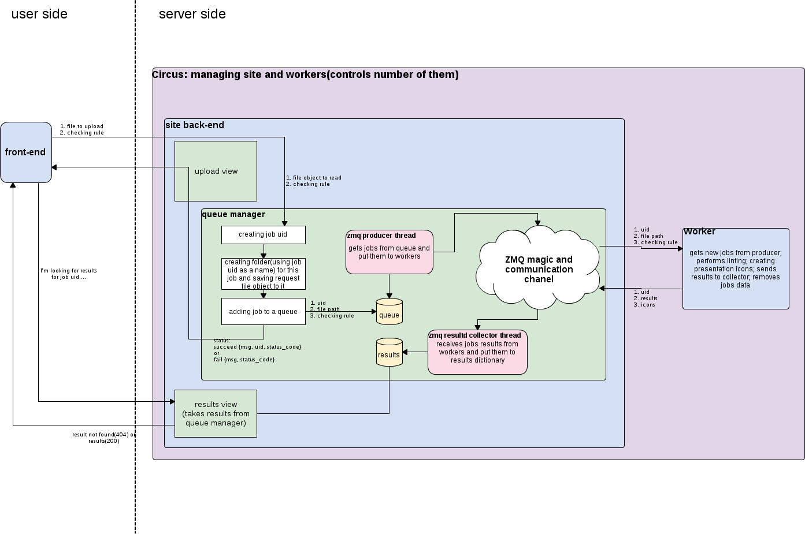

# Slidelint Site

slidelint site allows users to check theirs presentation with [slidelint](
https://github.com/enkidulan/slidelint) through web interface on-line.

This repository contain buildout and sources for slidelint site.

# Setting up a slidelint site

## System requirements

The slidelint site is written in **Python 3**.
 * Python 3.3 (3.2 is too old and 3.4 is currently too new and not compatible with Circus)
 * ZMQ 4 (or newer)
 * Docker

slidelint_site is developed and tested on Ubuntu Trusty. Your milage on other
Linux systems and Ubuntu versions may vary.

The site requires the packages are installed on your system:
 * python3-devel
 * libevent-devel
 * zeromq3-devel
 * docker

In Ubuntu you can install them with the following command
```bash
apt-get install python3-dev libevent-dev libzmq3-dev
```

To install Docker take a look at its installation instruction at https://docs.docker.com/

Once the requirements are installed, you can use buildout to get the Python
dependencies. See the example below:

```bash
cp buildout.cfg.example buildout.cfg
vim buildout.cfg  # Edit the buildout config to contain the required settings
python3 bootstrap.py
bin/buildout
```

## Starting the Site

Run the command
```bash
bin/circusd circus.ini
```

## Configuring the Site

You can configure site by editing buildout.cfg.

The two sections you are likely to be interested in are:

 * The mailing configuration. This controls where error messages are sent.

```INI
[mailing_config]
mailloger_host = localhost
mailloger_from = notification@example.com
mailloger_to = manager@example.com
mailloger_subject = SlideLint: Error has occurred
# credentials should be written as ", ('name', 'password')"
mailloger_credentials =
mail_subject = Slidelint: feedback received
mail_port = 25
```

 * The second is worker config. This controls how workers are created and set up.

```INI
[worker_config]
slidelint = docker run -t -c 4 -v {default_config_path}:/config -v {presentation_location}:/presentation --networking=false slidelint/box slidelint -f json --files-output=/presentation/{presentation_name}.res --config={config_path} /presentation/presentation.pdf
onetime = true
debug_url =
```

 * The instance_config section allows you to change the site configuration, such
   as port, logger levels and other.
```INI
[instance_config]
server_port = 8080
```

Please note that all section in buildout.cfg are just shortcuts to make setup
easier, to see all available options take a look at [base.cfg](profiles/base.cfg)
file at sections instance_config, mailing_config, circus_config and worker_config.

# Site Structure

This site is separated into three parts:
 * User front-end, that users interact with.
 * Server back-end, that queues the linting process to be done.
 * Workers, that actually perform presentations linting with slidelint.

The system works as follows:
 * The user provided file is ?sent? from the front-end to the backend.
 * Backend takes the file and add new job to queue.
 * Free worker picks up the job, preforms linting, sending the results to the
   collector.
 * Front-end asking backend's collector about job results until it receive them.



## Front-end

This part of the system allows users to upload presentations files, shows the
uploading process and waiting message, and finally shows users results.

The front-end is based on [Angular](https://angularjs.org).

Files related to front-end:
 * `slidelint_site/templates/index.pt` - main page that loads angular app
 * `slidelint_site/static` - static resources(images, css, js, ...)
 * `slidelint_site/static/js/app.js` - angular application that
   implements front-end behavior
 * `slidelint_site/static/templates/waiting.html` - template for modal
   dialog that shows uploading progress and waiting message

### Linting

Linting process is three steps:

 1. Showing visitor a file uploading form.
 2. Showing awaiting form (and sending file to server, and waiting for
    results).
 3. Showing slide linting results (and in case if something goes wrong
    showing to user 'try later' message).


## Backend

### Queuing and Worker(s)

We use the "OMQ" found at http://zeromq.org

Overall, the system works like follows;
 * Website puts something into the queue.
 * Worker gets item from queue and puts results somewhere.
 * Website polls to find out the result.

### Queue Manager

Code for the Queue Manager is in [queue_manager](slidelint_site/queue_manager.py)

It's a python queue that use zmq
[Divide-and-Conquer model](http://zguide.zeromq.org/page:all#Divide-and-Conquer)
to communicate with its workers.

It uses tcp protocol, so the worker can be separate from the site,
even on other machine.


## Workers

Files related to workers:
 * [slidelint_site/slidelint_site/worker.py](slidelint_site/slidelint_site/worker.py)
 * [slidelint_site/slidelint_site/utils.py](slidelint_site/slidelint_site/utils.py)

As the worker could be on its own machine, the worker uses its own
configuration file.

For our system:
 * Each worker is "throwed away" after it has completed a job.
 * Multiple workers are running at the same time (the number of workers can be
   configured on circus_config section - workers_number)


### "throw away" each worker after it has completed a job

[Circus](http://circus.readthedocs.org/en/latest/) is used for managing workers.
It allows not only control a number of running processes, but also a lot of
other things like max_age of worker and [others](https://circus.readthedocs.org/en/0.9.2/configuration/).
Basically Circus starts a new worker in when some of running workers died
("throwed away") and make sure that it is always the configured number of workers
 are available.


### Worker Sandboxing

We use docker for sanboxing / worker creation - https://docker.io/

The docker image slidelint/box is where slidelint was installed and
configuration files was added.

The sandboxed slidelint check look like this
```bash
docker run -t -v {presentation_location}:/presentation --networking=false slidelint/box slidelint -f json --files-output=/presentation/{presentation_name}.res /presentation/presentation.pdf
```

The options are:
 * `-t` - Allocate a pseudo-tty
 * `-v {presentation_location}:/presentation` -
    mounting directory from computer to docker session. All directory content
    will be reachable in "/presentation" directory at docker envirovment.
 * `--networking=false` - disabling network access from running session
 * `slidelint -f json --files-output=/presentation/{presentation_name}.res /presentation/presentation.pdf` - here goes slidelint itself.

Any changes which were made inside session wouldn't be persistent.

# Errors handling

We have two separated applications - site and slidelint worker, so we can have
different logging handlers for each of them:

 * site will send full error trace-back to site administrator.
 * slidelint worker will save incoming PDF presentation file and send
   to administrator error trace-back with link to presentation.

There are also error logs in the `var` directory:
 * site_errors.log
 * site.log
 * worker_errors.log
 * workers.log

Incoming documents which cause issues will be saved to `debug_storage`
directory for review with details about what happened.

People can also reports errors via a feedback form.

## SMTP logging handler

The message looks like:

```
 2014-02-01 02:44:21,372 - root - ERROR -
    Slidelint process died while trying to check presentation.
    You can access this presentation by link
    http://slidelint.enkidulan.tk/debug/.../presentation.pdf.
    The command: 'slidelint -f json ...' died with the following traceback:

        Traceback (most recent call last):
        File "slidelint", line 9, in <module>  load_entry_point('slidelint==1.0dev', 'console_scripts', 'slidelint')()
        File "cli.py", line 106, in cli  lint(target_file, config_file, output, enable_disable_ids, msg_info)
        File "cli.py", line 89, in lint  output['files_output'], output['ids'])
        File "outputs.py", line 151, in output_handler  formated_report = formater(rezults)
        File "outputs.py", line 18, in __call__  filtred = [msg for msg in report if msg['id'] not in self.mute_ids]
        File "utils.py", line 88, in __iter__  raise IOError(checker_rez)
        IOError: The function 'wrapped' of 'slidelint.utils' module raised an Exception:
        No /Root object! - Is this really a PDF?
```

## Feedback form and view

There is a feedback form on the results page. It sends emails with the body
which looks like:

    Job id: ddb93ff1750248cdad8292eabd901f3a
    Feedback text:
    some feedback text some feedback text some feedback text some


# Validators

There are file size and file type validators at front-end (check file type and size before uploading) and back-end(won't upload more than allowed).
The max file size limit is configured by max_allowed_size variable in instance_config section (size is in bytes).
